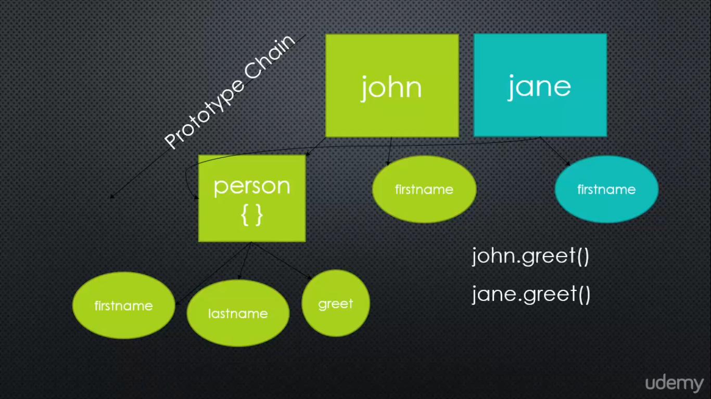
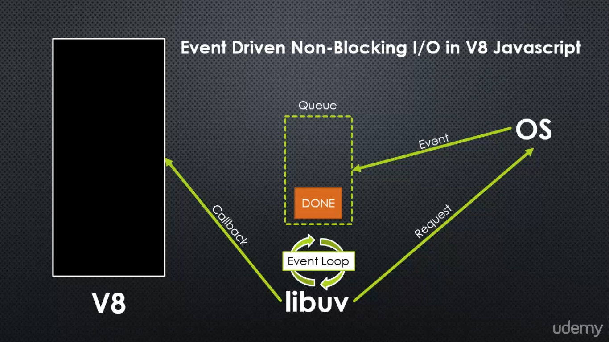

# Understanding-Node-JS
Notes on the course Understanding Node JS by Tony Alicea

Table of Content
<!-- TOC -->

- [Understanding-Node-JS](#understanding-node-js)
    - [Things JS needed in order to manage a server](#things-js-needed-in-order-to-manage-a-server)
    - [Classes in Javascript](#classes-in-javascript)
    - [2. V8 The JS Engine](#2-v8-the-js-engine)
        - [Machine code (Language)](#machine-code-language)
        - [ECMAScript](#ecmascript)
        - [Javascript Engine](#javascript-engine)
        - [What is Node.JS??](#what-is-nodejs)
    - [4. Modules Exports and Require](#4-modules-exports-and-require)
        - [Module](#module)
        - [CommonJS Modules](#commonjs-modules)
        - [First class functions](#first-class-functions)
        - [An expression](#an-expression)
        - [Name/Value pair](#namevalue-pair)
        - [Object in JS](#object-in-js)
        - [Object Literal](#object-literal)
        - [How to build a module?](#how-to-build-a-module)
        - [Inheritance](#inheritance)
        - [Prototypal inheritance](#prototypal-inheritance)
        - [Function constructors](#function-constructors)
        - [How to attach a method to prototype](#how-to-attach-a-method-to-prototype)
        - [Primitive](#primitive)
        - [By reference vs By Value](#by-reference-vs-by-value)
        - [Scope](#scope)
        - [Immediately invoked function expressions (IIFE)](#immediately-invoked-function-expressions-iife)
        - [Summary of require, module.exports](#summary-of-require-moduleexports)
        - [JSON](#json)
        - [Revealing Module Pattern](#revealing-module-pattern)
        - [Why we can assign a function to modules.export but not export??](#why-we-can-assign-a-function-to-modulesexport-but-not-export)
    - [5. Events and Event Emitter](#5-events-and-event-emitter)
        - [Event](#event)
        - [Event listener](#event-listener)
        - [Magic String](#magic-string)
        - [Object.create](#objectcreate)
        - [.call and .apply](#call-and-apply)
        - [Syntactic sugar](#syntactic-sugar)
        - [Classes in ES6](#classes-in-es6)
    - [6. Asynchronous Code, libuv, the event loop, stream files and more](#6-asynchronous-code-libuv-the-event-loop-stream-files-and-more)
        - [Asynchronous](#asynchronous)
        - [Synchronous](#synchronous)
        - [Callback](#callback)
        - [What's going on inside Node and why we say that it is async.](#whats-going-on-inside-node-and-why-we-say-that-it-is-async)
        - [Non-blocking](#non-blocking)
        - [Buffers](#buffers)
        - [Stream](#stream)
        - [Character set](#character-set)
        - [Character encoding](#character-encoding)
        - [Error-first callback](#error-first-callback)
        - [Chunk](#chunk)
        - [Abstract(Base) class](#abstractbase-class)
        - [How we will process data in Streams??](#how-we-will-process-data-in-streams)
        - [Pipe](#pipe)
        - [Method chaining](#method-chaining)
    - [7. HTTP and being a Web Server](#7-http-and-being-a-web-server)
        - [Protocol](#protocol)
        - [TCP/IP](#tcpip)
        - [Socket](#socket)
        - [Port](#port)
        - [HTTP](#http)
        - [MIME Type](#mime-type)
        - [API](#api)
        - [Endpoint](#endpoint)
        - [Serialize](#serialize)
        - [Routing](#routing)
        - [Template](#template)
        - [How to create a server with node](#how-to-create-a-server-with-node)
        - [API](#api-1)
        - [Endpoint](#endpoint-1)
        - [Serialize](#serialize-1)
        - [Routing](#routing-1)
    - [8. NPM and Node Package Manager](#8-npm-and-node-package-manager)
        - [Package](#package)
        - [Package management system](#package-management-system)
        - [Dependency](#dependency)
        - [Versioning (Semantic versioning)](#versioning-semantic-versioning)
        - [What is dev dependencies?](#what-is-dev-dependencies)
    - [9. Express](#9-express)
        - [Environment variables](#environment-variables)
        - [HTTP method](#http-method)
        - [Middleware](#middleware)
        - [Static](#static)
        - [How to setup a server using Express](#how-to-setup-a-server-using-express)
        - [Routing](#routing-2)
        - [REST](#rest)
    - [10. Javascript JSON and databases](#10-javascript-json-and-databases)
    - [11. The MEAN Stack](#11-the-mean-stack)

<!-- /TOC -->
## Things JS needed in order to manage a server
- Better ways to organize our code into reusable pieces
- Ways to deal with files
- Ways to deal with databases
- The ability to communicate over the internet
- The ability to accept request and send responses (in the standard format)
- A way to deal with work that takes a long time

## Classes in Javascript
- We understand that class in JS is just syntetic sugar to write a function constructor
```js
//Function constructor
function Police(firstname) {
    this.firstname = firstname;
}

//With classes
class Person {
    constructor(firstname) {
        this.firstname = firstname;
    }
}
```

- It replaces alot of things in function constructor
    - You dont need to use util.inherits anymore | It is now just extends after your class
    - You dont need initialise functions on prototype chain anymore | It is now just calling the function name in the class
    - You dont need to use .call(this) on the super class anymore | It is now just super()
```js

//The normal and old way
util.inherits(Police, Person);

function Police() {
    Person.call(this);
    this.badgesNumber = "1234"
}

Police.prototype.shoot = function() {
    console.log("Shooting");
}

//The class and new way
class Police extends Person {
    constructor(firstname) {
        super(firstname);
        this.badgesNumber = "1234"
    }

    //Function written in a class will be directly added to the prototype
    shoot() {
        console.log("Shooting");
    }
}

```
- However, it is still different from what we used to know about classes in other programming languages. This is still prototypical inheritence.

## 2. V8 The JS Engine
### Machine code (Language)
- **Programming languages spoken by computer processors**
- Every program you run on your computer has been converted (compiled) into machine code.
- Whenever we wrote programming language, there are some process that convert what we wrote into machine code so the processor can understand.

### ECMAScript
- **The standard JS is based on**
- Needed a standard since there are many engines.

### Javascript Engine
- **A program that converts JS code into something the computer processor can understand**
- And it should follow the ECMAScript standard on how the language should work and what features it should have.
- Node and V8 is written in C++.

### What is Node.JS??
- **Node JS is a C++ program, with V8 embedded, that is added a wealth of great features to make it suitable to be a server technology

## 4. Modules Exports and Require
### Module
- **A reusable block of code whose existence does not accidentally impact other code**
- Javascript didn't have this before

### CommonJS Modules
- An agreed upon standard for how code modules should be structured.

### First class functions
- **Everything you can do with other types you can do with functions.**
- You can use functions like strings, numbers, etc (i.e. pass them around, set variables equal to them, put them in arrays, and more)

### An expression
- **A block of code that results in a value**
- Function expressions are possible in JS because functions are first-class

```js
//function statement
function greet() {
    console.log("hi");
}

greet();

//functions are first class
function logGreeting(fn) {
    fn();
}

//We pass in a function here and the logGreeting func will call it.
logGreeting(greet);

//We can also create a function expression on the fly
logGreeting(function() {
    console.log("Hell yea");
})
```

### Name/Value pair
- **A name which maps to a value**
- The name may be defined more than once, but only can have one value in any given **context**
- That value may be more name/value pairs

### Object in JS
- A collection of name/value pair

### Object Literal
- **Name/value pairs seperated by commas and surrounded by curly braces**
- This is just a quick, shorthand way to create JS objects in code.

```js
{
    Street: 'Main',
    Number: 100,
    Apartment:
    {
        Floor: 3,
        Number: 301
    }
}

//Another object that is attached to a variable call person
var person = {
    firstName: "Jordan",
    lastName: "Tan",
    greet: function() {
        console.log(this.firstName + " " + this.lastName);
    }
}

//How to access the property of the object
//1.
person.firstName
// output: "Jordan"

//2.
person["firstName"]
//output: "Jordan"
```

### How to build a module?
- Use a require keyword to import the module. (eg: require('./greets') *The .js will be added automatically by the require function*)
- Use **module.export** to export a module.
- The code in the other module will be run in another context so it won't interrupt what variables or function we have in our main file.

### Inheritance
- **One object gets access to the properties and methods of another object**
- However the way JS implement inheritance is different from other programming language (classical inheritance), and it's call prototypal inheritance.

### Prototypal inheritance
- Every object has a property that points to another object. It's the object's prototype. It's the thing it inherits from.
- A prototype can have another property that points to another prototype, hence the prototype chain.
- You can call the properties or functions of a prototype by using the dot notation. (eg: jordan.numberOfLegs, *the numberOfLegs is a property in the prototype*)

### Function constructors
- **A normal function that is used to construct objects**
- The 'this' variable points a new empty object, and that object is returned from the function automatically.

### How to attach a method to prototype
- It is a good practise to attach method to the object's prototype while keeping the variables to the object itself, this is because we can save alot of resources by not instantiating all the method every single time when creating a new object.

```js
//Create a Person function constructor
function Person(firstname, lastname) {
    this.firstname = firstname;
    this.lastname = lastname;
}

//Assign a function to the prototype object
Person.prototype.greet = function() {
    console.log('Hello, ' + this.firstname + ' ' + this.lastname);
}

var john = new Person("Jordan", "Tan");

//The JS engine will look for greet in the john object, if it can't find the greet function, it will goes down the prototype chain to look for the greet function.
john.greet();

//Output: 'Hello, Jordan Tan'
```

### Primitive
- **A type of data that represents a single value**
- Like a number or a string. In other words, not an object.

### By reference vs By Value
- Primitive type value will be copy.
- Reference type will points to the same location in memory.

- The example below shows the difference in code.
```js
//Pass by value
function change(b) {
    b = 2;
}

var a = 1;
change(a);

console.log(a);
//Output: 1
//The value of a is copied by b and place in a different location in memory.

//Pass by reference
function changeObj(d) {
    d.prop1 = function() {};
    d.prop2 = {};
}

var c = {};
c.prop1 = {};

changeObj(c);
console.log(c);
//Output: { prop1: [Function], prop2: {} }
//This is because the value of c is being refered by the function.
```

### Scope
- Where in code you have access to particular variable or function.

### Immediately invoked function expressions (IIFE)
- Variables written in a function will not impact the variables in the global scope. They are seperated, so we can use 2 variables with the same name.

```js

//Function statement
var name = 'Jordan'

var func = function() {
    var name = 'Jeslynn';
    console.log(name);
}

func();

//The name here wont be overwrite by the name in the function.
console.log(name);

/* Output:
Jeslynn
Jordan
*/

//IIFE
//It's almost the same without us having to call the function statement manually. It will invoke the function immediately hence the name: Immediately Invoked Function Expression
var name = 'Jordan';

(function() {
    var name = 'Jeslynn';
    console.log(name);
}())

console.log(name);

/* Output:
Jeslynn
Jordan
*/
```

### Summary of require, module.exports
- **require** is a function, that you pass a 'path' to
- **module.exports** is what the require function returns
- this works because **your code is actually wrapped in a function** that is given these things as function parameters

### JSON
- **Javascript Object Notation**
- A standard for structuring data that is inspired by JS object literals
- JS engines are built to understand it

- Example of JSON syntax below:
```js
{
    "firstname": "John",
    "lastname": "Doe",
    "address": {
        "street": "101 Main St.",
        "city": "New York",
        "state": "NY"
    }
}
```

### Revealing Module Pattern
- **Exposing only the properties and methods you want via an returned object**
- A very common and clean way to structure and protect code within modules.

### Why we can assign a function to modules.export but not export??
- If you look into the source code of node.js, you will eventually find that **modules.export** and **export** points to the same location.
- But there is a quirk in JS, when you assign a value to the other reference, it will break the reference. It will points to a new location
- What we can do is mutate the reference. Meaning that you change the value of the object.

## 5. Events and Event Emitter
### Event
- **Something that has happened in our app that we can respond to**
- In Node, we actually talk about 2 different kinds of event.
- System events(C++ core using **libuv**) and Custom events(JS core using **Event Emitter**)
- Event in JS is actually just **an object of properties full of arrays of function**
- Here's some example code:
```js
function Emitter() { //First we create a object constructor
    this.events = {};
}

Emitter.prototype.on = function(type, listener) { //We put the functionality of the Emitter in the prototype chain.
//The 2 main function is on and emit

    this.events[type] = this.events[type] || []; //Check to see whether we have this event type in our event emitter. If no assign an empty array to it.
    this.events[type].push(listener); //Add the listener to the events type.

}

Emitter.prototype.emit = function(type) { //Emit is to call.
    if(this.events[type]) { //We check to see if there is such event type in the object.
        this.events[type].forEach(function(listener) {
            //We loop through the arra and call the function.
            listener();
        })
    }
}
```

### Event listener
- **The code that respond to an event**
- In JS's case, the listener will be a function

### Magic String
- **A string that has some special meaning in our code**
- This is bad because it makes it easy for a typo to cause a bug, and hard for tools to help us find it.
- How to solve this problem? (The solution mentioned above is just a coding pattern, it's by no means a rule to follow)
- Solution: (In code)

```js
//1. Create a file (config.js)

//2. Create an object in the file
module.exports = {
    events = {
        GREET: 'greet',
        FILESAVED: 'filesaved',
        FILEOPENED: 'fileopened'
    }
}

//3. Import it in the place you want to use.

//4. The editor (VS Code) will help us autocomplete and even catch  the error.
```

### Object.create
- Object.create will create an object and assign the object you passed in as it's prototype.
- This is an powerful concept cause it allows object to inherits prototype. (I'm not sure whether object created with function constructor do inherit from prototype)
- Here's an example
```js

//We create an object call person (Note that this is not a function constructor)
var person = {
    firstName: '';
    lastName: '';
    greet: function() {
        console.log(this.firstName + " " + this.lastName);
    }
}

var john = Object.create(person);
john.firstName = "John";
john.lastName = "Lee";
john.greet(); //output: John Lee
```

Here's an visual representation of the concept discussed above.


### .call and .apply
- It's just another way to **invoke(call) function** (eg: function() == function.call())
- We can **pass in an obj** with .call & .apply that can change what the **this** is pointing to in the function
- The difference between .call and .apply is, if there is any other extra arguments that the function accepts, **.apply** accepts it in the form of an array.
- .call and .apply are used to **imitate superclass**(what we inherits from) in other language.

### Syntactic sugar
- **A feature that only changes how you type something, but nothing changes under the hood**
- It's important to understand what's happening under the hood, so we don't make decisions based on flawed assumptions.

### Classes in ES6
- In ES6, JS introduce the keyword **class**
- It is just a syntactic sugar for writing object.
- It allows inheritance by using the keyword **extends**
- Under the hood it is still creating the same thing. Just different ways to write the same thing.

## 6. Asynchronous Code, libuv, the event loop, stream files and more

### Asynchronous
- **More than one process running simultaneously.**
Node does things asynchronously. V8 does not.

### Synchronous
- **One process executing at a time.**
- Javascript is synchronous. Think of it as one line of code executing at a time.
- NodeJS is asynchronous
- Don't confuse Node with JS

### Callback
- ** A function passed to some other function, which we assume will be invoked at some point
- The function 'call back' invoking the function you give it when it is done doing its work.

### What's going on inside Node and why we say that it is async.


- I will try to explain the image above:
- When we talk about events happening in Node, we are actually talking about 2 different things, 1 is the events happening in C++ core, 1 is the events happening in JS core.
- In C++, the events are created using **libuv**
- libuv is used to request something from the OS (open a file, read file, etc)
- Whatever happens is an event (the internet is slow, the file is opened, etc), and it is placed in a queue
- There is an event loop that will run in a loop to check whether there is any done events queueing in the queue.
- libuv sees something is in the queue, and it will process it and it runs a callback

### Non-blocking
- Doing other things without stopping your programming from running
- This is made possible by Node's asynchronous nature.

### Buffers
- A temporary holding spot for data being moved from one place to another
- Intentionally limited in size
- Use for gathering data and move it along
- Think of Youtube video when we say buffering, we are actually waiting for the data to be fully fill the buffer.
- We can use buffer to do character encoding.
- In reality, we won't directly deal with buffer.

```js
//You don't need to import buffer cause it is so important, node make it global to the program
var buf = new Buffer('Hello', 'utf8');
console.log(buf);
console.log(buf.toString());
console.log(buf.toJSON());

//We can also write data to the buffer
buf.write('wo');
```

### Stream
- A sequence of data made available over time.
- Pieces of data that eventually combined into a whole.
- When we stream a movie, we are actually downloading the movie, but in small pieces.
- Stream is normally combined with buffer, the buffer will sits on the stream and hold a certain size of data and pass it down for the stream to process then repeat.

### Character set
- A representation of characters as numbers.
- Each character gets a number. **Unicode** and **ASCII** are character sets.
- Character set is in **decimal**

### Character encoding
- How character are stored in binary
- The numbers (or code points) are converted and stored in binary
- Eg: **UTF-8**
- Character encoding is in **binary**

### Error-first callback
- **Callbacks take an error object as their first parameter**
- null if no error, otherwise will contain an object defining the error. This is a standard so we know in what order to place our parameters for our callbacks.

### Chunk
- A piece of data being sent down a stream
- Data is splitted in chunks and streamed

### Abstract(Base) class
- A type of constructor you never work directly with, but inherits from
- We create new custom objects which inherit from the abstract base class

### How we will process data in Streams??
- Below are steps of how streams will process data
- 1. Read some of the text file
- 2. Fill the buffer sitting on the stream
- 3. Emit the *data* event
- 4. Run all the listener
- 5. Keep repeating until the file is end reading

- Example code below:
```js
var fs = require('fs');

//This will read the file
var readable = fs.createReadStream(__dirname + '/greet.txt', {encoding: 'utf8', highWaterMark: 32 * 1024});

//This will write to the file call greetcopy.txt
var writable = fs.createWriteStream(__dirname + '/greetcopy.txt');

readable.on('data', function(chunk) {
    writable.write(chunk);
})
```

### Pipe
- **Connecting 2 streams by writing to one stream what is being read from another**
- In Node you pipe from a Readable stream to a Writable stream (Copying)
- It is basically what we just did above, but with all the heavy lifting handle by Node
- Pipe is only available on Readable and duplex (writable and readable) stream.
- We can actually write to any stream(The internet, database, gzip, etc), not just files.
- Example code:
```js
var fs = require('fs');

//Create a readable stream
var readable = fs.createReadStream(__dirname + '/greet.txt');

//Create a writable stream
var writable = fs.createWriteStream(__dirname + '/greetcopy.txt');

//This will return the destination. Since it returns a destination, we can actually pipe it again (If it is a duplex = readable + writable streaem).
readable.pipe(writable);
```

### Method chaining
- **A method return an object so we can keep calling more methods**
- Sometimes it returns the parent object (called 'cascading') and sometimes some other object

## 7. HTTP and being a Web Server
### Protocol
- **A set of rules 2 sides agree on to use when communicating.**
- Both the client and server are programmed to understand and use that particular set of rules. It's similar to 2 people from different countries agreeing on a language to speak in.

### TCP/IP
- Computers communicate over the internet by obeying TCP/IP. (A protocol)
- IP (Internet Protocol): Every computer that are connected to the internet have an IP address. An address for computers so other computers can identified it.
- TCP (Transmission Control Protocol): Will split the data into chunks of packages. The data may be sent in different protocol (HTTP, FTP, SMTP...)
- The packets send in by TCP are in stream of packets, so we can use streams and chunk in Node to handle it.

### Socket
- Socket is the line across which information flow.
- The idea of a socket isnt new, it needs to be turn on and off for computers to send and receive data over the internet.
- When we talks about **socket**, we are not talking about **Web Socket**. Web Socket keeps the socket opens constantly so we can achieve real time communcation over the internet.

### Port
- Once a computer program receives a packet, how it knows what program to send it to.
- When a program is setup on the OS to receive packets from a particular port, it is said that the program is 'listening' to the port.
- Port have numbers assign to it (eg: port 80), and the number is then map to the program on the server (eg: node, email) , so the server know where to send the data to when it receive a request to the port number.

### HTTP
- A set of rules (and a format) for data being transferred on the web
- Stands for 'Hypertext transfer protocol'. It's a format (of various) defining data being transferred via TCP/IP.

### MIME Type
- A standard for specifying the type of data being sent.
- Stands for 'Multipurpose Internet Mail Extensions'. Examples: application/json, text/html, image/jpeg

### API
- A set of tools for building a software application.
- Stands for 'Application programming interface'. On the web the tools are usually made available via a set of URLs which accept and send only data via HTTP and TCP/IP

### Endpoint
- One URL in a Web API
- Sometimes that endpoint (URL) does multiple thing by making choices based on the HTTP request headers.

### Serialize
- Translating an object into a format that can be stored or transferred.
- JSON, CSV, XML, and others are popular. 'Deserialize' is the opposite (converting the format back into an object)

### Routing
- Mapping HTTP request to content.
- Whether actual files that exists on the server, or not.

### Template
- Template is text designed to be the basis for final text or content after being processed.
- There's usually some specific template language, so the template system knows how to replace placeholders with real values.
- We do templating manually in Node by using replace
- Turn the html into string first and use the replace method to turn the {template} into the variable string
```js
var header = 'THis is a header';
html = html.replace('{header}', header);
```

### How to create a server with node
- This example is very popular in node because it is very easy and does alot of the work for us
```js
var http = require('http');
var fs = require('fs');

var server = http.createServer(function(req, res) {
    switch(req.url) {
        case "/":
            res.writeHead(200, 'Content-Type': 'text/html');
            fs.createReadStream(__dirname + '/index.html').pipe(res);
        break;

        case "/api":
            res.writeHead(200, 'Content-Type': 'application/json');
            var obj = {title: "3 idiots", author: 'Indians'};
            res.end(JSON.stringify(obj));
        break;

        default:
            res.writeHead(400);
            res.end();
        break;
    }
});

server.listen(8000, '127.0.0.1');
```

### API
- **A set of tools for building a software application**
- Stands for *Application Programming Interface*. On the web the tools are usually made available via a set of URLs which accepts and send only data via HTTP and TCP/IP.

### Endpoint
- One URL in a Web API
- Sometimes that endpoint (URL) does multiple things by making choices based on the HTTP request headers.

### Serialize
- **Translating an object into a format that can be stored or transferred**
- JSON, CSV, XML, and others are popular. 'Deserialize' is the opposite (converting the format back into an object)

### Routing
- Mapping HTTP request to content
- Whether actual files that exist on the server, or not

## 8. NPM and Node Package Manager
### Package
- Package is just a collection of code that you can use it in your code
- Managed and maintained with a package management system

### Package management system
- A management system is a software that automates installing and updating packages.
- Deals with what version you have or need, and manages **dependencies**.

### Dependency
- Code that another set of code depends on to function
- If you use that code in your app, it is a dependency. Your app depends on it.

### Versioning (Semantic versioning)
- Specifying what version of a set of code this is
- so others can track if a new version has come out. This allows to watch for new features, or to watch for 'breaking changes'
- The word 'semantic' implies that something conveys meaning
- Eg: Major.Minor.Patch (1.7.3)

### What is dev dependencies?
- Dependecies are code that your app depends on to function properly.
- Dev dependencies are code that are the code that you only need when you are in development process. (Eg: testing, automation)

```js
npm install nodemon --save-dev
```

## 9. Express
### Environment variables
- Global variables specific to the environment (server) our code is living in.
- Different servers can have different variable settings, and we can access those values in code.

### HTTP method
- Specifies the type of action the request wishes to make
- GET, POST, DELETE, and others. Also called **verbs**.

### Middleware
- Code that sits between 2 layers of software
- In the case of Express, sitting between the request and the response.

### Static
- Not dynamic
- In other words, not processed by code in any way. For example HTML, CSS and image files are 'static' files.

### How to setup a server using Express
```js
var express = require('express');
var app = express();

//In the listen method, express is creating a server with the http module behind the scene
var server = app.listen(80, listening);

function listening() {
    console.log('Port 80 is listening...');
}

//express.static is a middleware
app.use('/asset', express.static(__dirname + '/public'));

//We can create a custom middleware
//A middleware takes in 3 params, next is for running the next middleware.
app.use('/custom', function(req, res, next) {
    console.log("Requested URL: " req.url);
    next();
})

//This is consider a middleware too
app.get('/', function(req, res) {
    req.send("hello world");
})
```

### Routing
- The best place to find info about routing is the main docs of express
- We will just talk about how to pass variables via the route.
```js
app.get('/person/:id', function(req, res) {
    res.send('<html><head></head><body><h1>Person: ' + req.params.id '</h1></hq></body></html>)
});
```

### REST
- An architectural style for building APIs.
- Stands for 'Representation State Transfer'. We decide that HTTP verbs and URLs mean something.

## 10. Javascript JSON and databases

## 11. The MEAN Stack
- **The combination of all technologies used to build a piece of software**
- Your database system, your server side code, your client side code, and everything else.